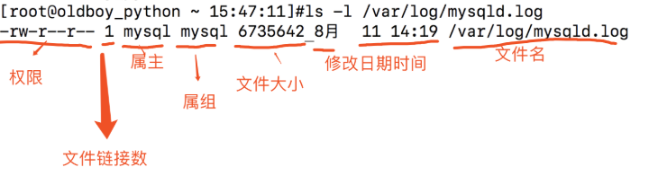
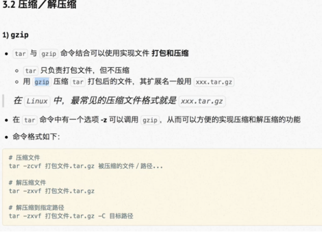
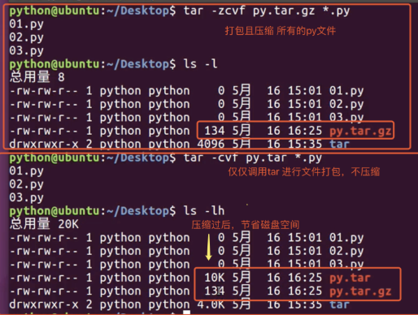
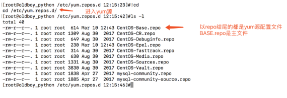

Linux复习基本命令


#### 创建目录/文本

```
make directory > mk dir > mkdir
-------------------------------
mkdir /oldboy
-------------------------------
cd /
mkdir oldboy

#递归创建a/b   c/d
mkdir -p a/b c/d

#递归创建test/a,b,c,d四个目录
mkdir -p test/{a,b,c,d}

#递归创建文件夹a/b/c/d/e
mkdir -p a/b/c/d/e

#修改文件的更改时间，很多黑客就会在恶意修改文件之后再修改成之前的时间
ls -l 
echo 'sb' >> xxx.py
touch -t'07101530' 1.txt

#触摸
touch xxx.py
```


#### 查看目录

```
#显示/oldboy下的内容
ls /oldboy

#打印当前工作目录
pwd 

cd /home
cd ~
cd -
```


#### stat命令

```
显示文件或文件系统的状态。
#用法 stat  [参数]  文件
参数列表：
  -L, --dereference     跟随链接
  -f, --file-system     显示文件系统状态而非文件状态
  -c --format=格式      使用指定输出格式代替默认值，每用一次指定格式换一新行
      --printf=格式     类似 --format，但是会解释反斜杠转义符，不使用换行作
                                输出结尾。如果您仍希望使用换行，可以在格式中
                                加入"\n"
  -t, --terse           使用简洁格式输出
      --help            显示此帮助信息并退出
      --version         显示版本信息并退出
格式化输出参数：
  %a    八进制权限
  %A   用可读性较好的方式输出权限


#实例1
[root@master tmp]# stat 1.txt
  File: '1.txt'
  Size: 0             Blocks: 0          IO Block: 4096   regular empty file
Device: fd00h/64768d    Inode: 17348002    Links: 1
(权限)Access: (0644/-rw-r--r--)  Uid: (    0/    root)   Gid: (    0/    root)
(最近访问)Access: 2018-07-10 15:30:00.000000000 +0800
(最近更改)Modify: 2018-07-10 15:30:00.000000000 +0800
(最近改动)Change: 2018-11-07 15:38:36.400989868 +0800
 Birth: -

#实例2，显示文件权限
[root@master tmp]# stat -c %a 1.txt
644
[root@master tmp]# stat -c %A 1.txt
-rw-r--r--
```


#### vim

所有的 Unix Like 系统都会内建 vi 文书编辑器，其他的文书编辑器则不一定会存在

```
#方法，命令
vi
vim
使用vi打开oldboy.py,默认是命令模式，需要输入a/i进入编辑模式,然后输入文本"Life is short,i use python"
按下esc键，回到命令模式
输入  :wq!  强制保存退出
w write 写入
q quit 退出
! 强制
或者  :x 保存退出
------
:q  不保存退出
:q! 不保存强制退出
```


#### 查看文本内容

```
cat命令用于查看纯文本文件（常用于内容较少的）
#查看文件，显示行号
cat -n xxx.py
#猫,查看文件
cat xxx.py

#在每一行的结尾加上$符
[root@master tmp]# cat -E 1.txt

#追加文字到文件
cat >>/tmp/oldboy.txt << EOF
唧唧复唧唧
木兰开飞机
开的什么机
波音747
EOF

more
1.more命令用于查看内容较多的文本，例如要看一个很长的配置文件，cat查看内容屏幕会快速翻滚到结尾。
2.more命令查看文本会以百分比形式告知已经看到了多少，使用回车键向下读取内容
more /etc/passwd
按下空格space是翻页
按下b键是上一页
回车键向下读取内容

------------------------------
echo命令用于在终端输出字符串或变量提取后的值，格式是“echo 【字符串|$变量】”
#默认吧内容显示到终端上    
echo "超哥666"
#超哥平时比较低调，不想让别人知道他666，怎么办？要么把“超哥666”写入到文件里！
echo "超哥666" > /tmp/chaoge.txt
echo $PATH #取出打印PATH的值

--------------------------------
head显示文件前几行，默认前10行
tail显示文件后几行，默认后10行
#查看前两行
head -2 /tmp/oldboy.txt
#查看后两行
tail -2 /tmp/oldboy.txt
#持续刷新显示
tail -f xx.log

#显示文件10-30行
head -30 /tmp/oldboy.txt |tail -21
```


#### 特殊符号

```
输入/输出 重定向符号
1.>>    追加重定向，把文字追加到文件的结尾
2.>     重定向符号，清空原文件所有内容，然后把文字覆盖到文件末尾
3.<     输入重定向
4.<<    将输入结果输入重定向
echo "oldboy-python666" > /tmp/oldboy.txt
echo "chaoge666" >> /tmp/oldboy.txt
cat >>/tmp/oldboy.txt << EOF
------------------------------------
我想把命令执行的结果信息，写入到文件中
ip addr > /tmp/network.txt   #标准输出重定向 把命令执行结果信息，放入到文件中
3.通配符  
ls -l /etc/us*
```


#### 复制/剪切/删除命令

```
复制 > copy > cp
#移动xxx.py到/tmp目录下
cp xxx.py /tmp/
#移动xxx.py顺便改名为chaoge.py
cp xxx.py /tmp/chaoge.py

Linux下面很多命令，一般没有办法直接处理文件夹,因此需要加上（参数） 
cp -r 递归,复制目录以及目录的子孙后代
cp -p 复制文件，同时保持文件属性不变    可以用stat
cp -a 相当于-pdr
#递归复制test文件夹，为test2
cp -r test test2

cp是个好命令，操作文件前，先备份
cp main.py main.py.bak

-----------------------------------
移动（搬家）命令  > move > mv
cd /home
#把老男孩从沙河这破地方，搬到朝阳去
mv /home/shahe/oldboy /tmp/chaoyang

文件/文件夹改名
mv x.log xx.log

-----------------------------------
删除  > remove > rm
参数  -i  需要删除确认
　　　-f  强制删除
     -r  递归删除目录和内容
     
cd /tmp
rm oldboy.py
#默认有提示删除，需要输入y
rm -f oldboy.py #不需要提示,强制删除
#rm默认无法删除目录，需要跟上参数-r
rm -rf /tmp/oldboy/

--------
友情提醒:初学者使用rm命令，随时快照虚拟机
```

seb 编辑器

```
sed是一种流编辑器，它是文本处理中非常中的工具，能够完美的配合正则表达式使用，功能不同凡响。处理时，把当前处理的行存储在临时缓冲区中，称为“模式空间”（pattern space），接着用sed命令处理缓冲区中的内容，处理完成后，把缓冲区的内容送往屏幕。接着处理下一行，这样不断重复，直到文件末尾。文件内容并没有 改变，除非你使用重定向存储输出。Sed主要用来自动编辑一个或多个文件；简化对文件的反复操作；编写转换程序等。

命令格式

sed [options] 'command' file(s)
sed [options] -f scriptfile file(s)
选项

-e<script>或--expression=<script>：以选项中的指定的script来处理输入的文本文件；
-f<script文件>或--file=<script文件>：以选项中指定的script文件来处理输入的文本文件；
-h或--help：显示帮助；
-n或--quiet或——silent：仅显示script处理后的结果；
-V或--version：显示版本信息。
-i ∶插入， i 的后面可以接字串
sed命令

a\ 在当前行下面插入文本。
i\ 在当前行上面插入文本。
c\ 把选定的行改为新的文本。
d 删除，删除选择的行。
D 删除模板块的第一行。
s 替换指定字符
h 拷贝模板块的内容到内存中的缓冲区。
H 追加模板块的内容到内存中的缓冲区。
g 获得内存缓冲区的内容，并替代当前模板块中的文本。
G 获得内存缓冲区的内容，并追加到当前模板块文本的后面。
l 列表不能打印字符的清单。
n 读取下一个输入行，用下一个命令处理新的行而不是用第一个命令。
N 追加下一个输入行到模板块后面并在二者间嵌入一个新行，改变当前行号码。
p 打印模板块的行。
P(大写) 打印模板块的第一行。
q 退出Sed。
b lable 分支到脚本中带有标记的地方，如果分支不存在则分支到脚本的末尾。
r file 从file中读行。
t label if分支，从最后一行开始，条件一旦满足或者T，t命令，将导致分支到带有标号的命令处，或者到脚本的末尾。
T label 错误分支，从最后一行开始，一旦发生错误或者T，t命令，将导致分支到带有标号的命令处，或者到脚本的末尾。
w file 写并追加模板块到file末尾。  
W file 写并追加模板块的第一行到file末尾。  
! 表示后面的命令对所有没有被选定的行发生作用。  
= 打印当前行号码。  
# 把注释扩展到下一个换行符以前。  
sed替换标记

g 表示行内全面替换。  
p 表示打印行。  
w 表示把行写入一个文件。  
x 表示互换模板块中的文本和缓冲区中的文本。  
y 表示把一个字符翻译为另外的字符（但是不用于正则表达式）
\1 子串匹配标记
& 已匹配字符串标记
sed元字符集

^ 匹配行开始，如：/^sed/匹配所有以sed开头的行。
$ 匹配行结束，如：/sed$/匹配所有以sed结尾的行。
. 匹配一个非换行符的任意字符，如：/s.d/匹配s后接一个任意字符，最后是d。
* 匹配0个或多个字符，如：/*sed/匹配所有模板是一个或多个空格后紧跟sed的行。
[] 匹配一个指定范围内的字符，如/[ss]ed/匹配sed和Sed。  
[^] 匹配一个不在指定范围内的字符，如：/[^A-RT-Z]ed/匹配不包含A-R和T-Z的一个字母开头，紧跟ed的行。
\(..\) 匹配子串，保存匹配的字符，如s/\(love\)able/\1rs，loveable被替换成lovers。
& 保存搜索字符用来替换其他字符，如s/love/**&**/，love这成**love**。
\< 匹配单词的开始，如:/\<love/匹配包含以love开头的单词的行。
\> 匹配单词的结束，如/love\>/匹配包含以love结尾的单词的行。
x\{m\} 重复字符x，m次，如：/0\{5\}/匹配包含5个0的行。
x\{m,\} 重复字符x，至少m次，如：/0\{5,\}/匹配至少有5个0的行。
x\{m,n\} 重复字符x，至少m次，不多于n次，如：/0\{5,10\}/匹配5~10个0的行。
sed实际用例
#替换oldboy.txt中所有的oldboy变为oldboy_python
#此时结果输出到屏幕,不会写入到文件
sed 's/oldboy/oldboy_python/' /tmp/oldboy.txt
#使用选项-i，匹配每一行第一个oldboy替换为oldboy_python,并写入文件
sed -i 's/oldboy/oldboy_python/' /tmp/oldboy.txt
#使用替换标记g，同样可以替换所有的匹配
sed -i 's/book/books/g' /tmp/oldboy.txt
#删除文件第二行
sed -i '2d' /tmp/oldboy.txt
#删除空白行
sed -i '/^$/d' /tmop/oldboy.txt
#删除文件第二行，到末尾所有行
sed '2,$d' /tmp/oldboy.txt
#显示10-30行
-p --print
-n --取消默认输出
sed -n '10,30p' /tmp/oldboy.txt

```


#### 查找命令

```
#Linux里如何找到需要的文件 例如 oldboy.py
find 在哪里(目录) 什么类型（文件类型） 叫什么名字（文件名）
参数
-name 按照文件名查找文件
-type 查找某一类型的文件，诸如：
b - 块设备文件。
d - 目录。
c - 字符设备文件。
p - 管道文件。
l - 符号链接文件。
f - 普通文件。
s - socket文件

find /tmp/ -type f  -name "oldboy.py"

#找出/tmp所有以 .txt 结尾的文件
find /tmp/ -type f -name "*.txt"

#找到/etc下所有名字以host开头的文件
find /etc -name 'host*'

#找到/opt上一个名为settings.py
find /opt -name 'settings.py
```


#### 管道命令

```
Linux提供的管道符“|”讲两条命令隔开，管道符左边命令的输出会作为管道符右边命令的输入。
常见用法：
#检查python程序是否启动
ps -ef|grep "python"

#找到/tmp目录下所有txt文件
ls /tmp|grep '.txt'

#检查nginx的端口是否存活
netstat -tunlp |grep nginx

-----------------------------------------
grep语法：(global search regular expression(RE) and print out the line,全面搜索正则表达式并把行打印出来)是一种强大的文本搜索工具，它能使用正则表达式搜索文本，并把匹配的行打印出来。
语法：
grep [参数] [--color=auto] [字符串] filename
参数详解:
-i : 忽略大小写
-n : 输出行号
-v : 反向选择
--color = auto : 给关键词部分添加颜色

grep "我要找什么" /tmp/oldboy.txt
#排除 -v，排除我要找的东西
grep -v "我要找什么 /tmp/oldboy.txt

例题：
1、找出/etc/passwd下root用户所在行，以及行号，显示颜色
cat /etc/passwd |grep '^root' --color=auto -n
2、找出/etc/passwd所有不允许登录的用户
grep /sbin/nologin /etc/passwd
3、找到/etc/passwd的所有与mysql有关行，行号
cat /etc/passwd |grep 'mysql' -n
```


#### 别名alias命令

Linux在使用rm（删除）、cp（覆盖）、mv（搬家）等命令的时候，必须非常小心，因为这些命令都是“炸弹”，想必大家都听过“删库到跑路”，一言不合“rm -rf /”，假如你真的这么做了，那么。。。上帝保佑你

```
Linux如何提示你，在使用这些命令时候，提醒你小心呢？
#查看系统别名
alias
默认别名
alias cp='cp -i'
alias egrep='egrep --color=auto'
alias fgrep='fgrep --color=auto'
alias grep='grep --color=auto'
alias l.='ls -d .* --color=auto'
alias ll='ls -l --color=auto'
alias ls='ls --color=auto'
alias mv='mv -i'
alias rm='rm -i'
alias which='alias | /usr/bin/which --tty-only --read-alias --show-dot --show-tilde'

别名作用是：

我们在linux中使用cp时候相当于执行了cp -i
-i：删除已有文件或目录之前先询问用户；

#别名用比较危险的操作,防止你犯错 
```


#### scp命令

Linux scp命令用于Linux之间复制文件和目录。

scp是 secure copy的缩写, scp是linux系统下基于ssh登陆进行安全的远程文件拷贝命令。

```
语法
scp 【可选参数】 本地源文件 远程文件标记

参数：
-r :递归复制整个目录
-v:详细方式输出
-q:不显示传输进度条
-C：允许压缩

#传输本地文件到远程地址
scp 本地文件  远程用户名@远程ip:远程文件夹/
scp 本地文件  远程用户名@远程ip:远程文件夹/远程文件名

scp /tmp/chaoge.py root@192.168.1.155:/home/
scp /tmp/chaoge.py root@192.168.1.155:/home/chaoge_python.py

scp -r  本地文件夹  远程用户名@远程ip:远程文件夹/
scp -r /tmp/oldboy root@192.168.1.155:/home/oldboy

#复制远程文件到本地
scp root@192.168.1.155:/home/oldboy.txt /tmp/oldboy.txt
scp -r root@192.168.1.155:/home/oldboy /home/
```

#### du命令

Linux du命令用于显示目录或文件的大小。

du会显示指定的目录或文件所占用的磁盘空间。

```
用法
du 【参数】【文件或目录】
-s 显示总计
-h 以k，M,G为单位显示，可读性强

显示目录或文件所占空间
#什么都不跟，代表显示当前目录所有文件大小
du   

#显示/home的总大小
du -sh /home
```

#### top命令

top 命令用于动态地监视进程活动与系统负载等信息，我们来分析一下图片信息，统计信息区

```
第一行 (uptime)
系统时间 主机运行时间 用户连接数(who) 系统1，5，15分钟的平均负载
第二行:进程信息
进程总数 正在运行的进程数 睡眠的进程数 停止的进程数 僵尸进程数
第三行:cpu信息
1.5 us：用户空间所占CPU百分比
0.9 sy：内核空间占用CPU百分比
0.0 ni：用户进程空间内改变过优先级的进程占用CPU百分比
97.5 id：空闲CPU百分比
0.2 wa：等待输入输出的CPU时间百分比
0.0 hi：硬件CPU中断占用百分比
0.0 si：软中断占用百分比
0.0 st：虚拟机占用百分比
第四行：内存信息（与第五行的信息类似与free命令）

8053444 total：物理内存总量
7779224 used：已使用的内存总量
274220 free：空闲的内存总量（free+used=total）
359212 buffers：用作内核缓存的内存量
第五行：swap信息
8265724 total：交换分区总量
33840 used：已使用的交换分区总量
8231884 free：空闲交换区总量
4358088 cached Mem：缓冲的交换区总量，内存中的内容被换出到交换区，然后又被换入到内存，但是使用过的交换区没有被覆盖，交换区的这些内容已存在于内存中的交换区的大小，相应的内存再次被换出时可不必再对交换区写入。
```

#### chattr命令

```
给文件加锁，只能写入数据，无法删除文件
chattr +a test.py
chattr -a test.py
```

#### lsattr命令

```
查看文件隐藏属性

lsattr test.py
```

#### 格式化输出时间

```
-d    --date=string    显示指定的时间，而不是当前时间
以年-月-日显示当前时间
date +"%Y-%m-%d"
以年-月-日 时分秒 显示当前时间
date +"%Y-%m-%d %T"
```

#### wget命令

```
wget命令用于在终端下载网络文件
参数是 wget [参数] 下载地址
wget -r -p http://www.luffycity.com#递归下载路飞所有资源，保存到www.luffycity.com文件中
```

Linux的网络功能相当强悍，一时之间我们无法了解所有的网络命令，在配置服务器基础环境时，先了解下网络参数设定命令。

- ifconfig　　查询、设置网卡和ip等参数
- ifup,ifdown    脚本命令，更简单的方式启动关闭网络
- ip　　符合指令，直接修改上述功能

```
在我们刚装好linux的时候，需要用xshell进行远程连接，那就得获取ip地址，有时候网卡默认是没启动的，Linux也就拿不到ip地址，因此我们得手动启动网卡
#编辑网卡配置文件
vim /etc/sysconfig/network-scripts/ifcfg-eth0 
#修改配置参数
ONBOOT=yes
```

#### 网卡配置文件详解

```
网络配置文件：
/etc/sysconfig/network

网络接口配置文件：
/etc/sysconfig/network-scripts/ifcfg-INTERFACE_NAME
DEVICE=: 关联的设备名称，要与文件名的后半部“INTERFACE_NAME”保持一致; 
BOOTPROTO={static|none|dhcp|bootp}: 引导协议；要使用静态地址，使用static或none；dhcp表示使用DHCP服务器获取地址；
IPADDR=: IP地址
NETMASK=：子网掩码
GATEWAY=：设定默认网关；
ONBOOT=：开机时是否自动激活此网络接口；
HWADDR=： 硬件地址，要与硬件中的地址保持一致；可省；
USERCTL={yes|no}: 是否允许普通用户控制此接口；
PEERDNS={yes|no}: 是否在BOOTPROTO为dhcp时接受由DHCP服务器指定的DNS地址；

ifup,ifdown命令：
启动/关闭一块网卡
    ifup eth0
    ifdown eth0
```

#### ifconfig命令

```
ifconfig 查看网卡的ip地址

直接输入ifconfig会列出已经启动的网卡，也可以输入ifconfig eth0单独显示eth0的信息
各选项解释是：
eth0    网卡的代号 
lo        回环地址loopback
inet    IPv4的Ip地址
netmask    子网掩码
broadcast    广播地址
RX/TX     流量发/收情况     tx是发送（transport），rx是接收(receive)
packets     数据包数
errors     数据包错误数
dropped    数据包有问题被丢弃的数量
collisions    数据包碰撞情况，数值太多代表网络状况差


#查看系统版本信息
cat /etc/redhat-release 
CentOS Linux release 7.4.1708 (Core) 
#查看内核版本号
uname -r
3.10.0-693.el7.x86_64
#查看系统多少位
uname -m
x86_64
#查看内核所有信息
uname -a
```

#### 用户管理

- 创建普通用户

  ```
  #添加用户
  useradd oldboy 
  #设置密码       
  passwd redhat
  
  root用户可以修改其他所有人的密码，且不需要验证
  ```

- 切换用户

  ```
  su命令可以切换用户身份的需求，
  su - username
  
  su命令中间的-号很重要，意味着完全切换到新的用户，即环境变量信息也变更为新用户的信息
  #先看下当前用户（我是谁）
  whoami
  #切换用户
  su - oldboy
  #退出用户登录
  logout
  ctrl + d
  ```

- userdel删除用户

  ```
  -f     强制删除用户
  -r    同事删除用户以及家目录
  userdel -r pyyu 
  ```

- sudo命令

  **sudo命令**用来以其他身份来执行命令，预设的身份为root。在`/etc/sudoers`中设置了可执行sudo指令的用户。若其未经授权的用户企图使用sudo，则会发出警告的邮件给管理员。用户使用sudo时，必须先输入密码，之后有5分钟的有效期限，超过期限则必须重新输入密码。

  语法：

  ```
  sudo 【选项】【参数】
      -b：在后台执行指令；
      -h：显示帮助；
      -H：将HOME环境变量设为新身份的HOME环境变量；
      -k：结束密码的有效期限，也就是下次再执行sudo时便需要输入密码；。
      -l：列出目前用户可执行与无法执行的指令；
      -p：改变询问密码的提示符号；
      -s<shell>：执行指定的shell；
      -u<用户>：以指定的用户作为新的身份。若不加上此参数，则预设以root作为新的身份；
      -v：延长密码有效期限5分钟；
      -V ：显示版本信息。
  ```

  - 配置文件：这是由于配置sudo必须编辑/etc/sudoers文件，并且只有root才能修改，咱们可以通过visudo命令直接编辑sudoers文件，使用这个命令还可以检查语法，比直接编辑 vim /etc/sudoers更安全

    ```
    visudo 编辑sudoers文件
    
    写入
    ## Allow root to run any commands anywhere
    root    ALL=(ALL)       ALL
    chaoge  ALL=(ALL)       ALL   #允许chaoge在任何地方，执行任何命令
    
    此时切换 xingge 用户
    #su命令用于切换当前用户身份到其他用户身份，变更时须输入所要变更的用户帐号与密码。
    su - xingge
    已经可以使用sudo ls /root 命令
    ```

- linux权限的观察

  ```
  ls -l /var/log/mysqld.log 
  ```

  

  ```
  解读上图：
      权限，第一个字母为文件类型，后续9个字母，每3个一组，是三种身份的权限
      文件链接数
      文件拥有者-属主
      文件拥有组-属组
      文件大小
      最后一次被修改的时间日期
      文件名 
      
  分析文件类型：
      -    一般文件
      d    文件夹
      l    软连接（快捷方式）
      b    块设备，存储媒体文件为主
      c    代表键盘,鼠标等设备
  
  文件权限
      r    read可读，可以用cat等命令查看
      w    write写入，可以编辑或者删除这个文件
      x    executable    可以执行
      
  目录权限
      r    可以对此目录执行ls列出所有文件
      w    可以在这个目录创建文件
      x    可以cd进入这个目录，或者查看详细信息
  ```

  


#### 修改文件权限属性

```
普通用户只能修改自己的文件名，时间与权限（注意）
因此修改其他用户权限，只能用最nb的root用户
```

\#切换root用户

[pyyu@oldboy_python root]$ su -

```
当前/tmp/pyyu.txt文件以存在，且信息是
-rw-rw-r-- 1 pyyu pyyu    0 8月  11 16:41 pyyu.txt
```

修改属主为root

chown

```
[root@oldboy_python /tmp 16:43:12]#chown root pyyu.txt 
```

查看信息

```
[root@oldboy_python /tmp 16:43:42]#ll pyyu.txt 
-rw-rw-r-- 1 root pyyu 0 8月  11 16:41 pyyu.txt
```

修改属组

chgrp

```
[root@oldboy_python /tmp 16:43:42]#ll pyyu.txt 
-rw-rw-r-- 1 root pyyu 0 8月  11 16:41 pyyu.txt
[root@oldboy_python /tmp 16:44:59]#chgrp root pyyu.txt 
[root@oldboy_python /tmp 16:45:51]#ll pyyu.txt 
-rw-rw-r-- 1 root root 0 8月  11 16:41 pyyu.txt
```

#### 修改权限的命令

chmod

```
chmod [身份]　　 [参数] 　　[文件]　　　　u(user)　　 +(添加)　　　　　　g(group)　  -(减去)　　　　o(other)　　=(赋值)　　　　a(all)
```

例如

```
当前权限
-rw-rw-r-- 1 root root 0 8月  11 16:41 pyyu.txt
方法1
减去属主的写权限
chmod u-w pyyu.txt
查看权限
-r--rw-r-- 1 root root 0 8月  11 16:41 pyyu.txt

方法2
属主添加可读可写可执行权限
chmod 700 pyyu.txt

属主可读可写可执行
属组可读可执行
其他人可读可执行
chmod 755 pyyu.txt
```

修改文件名，修改文件更改日期

```
mv pyyu.txt chaoge.txt#触摸，修改时间
touch chaoge.txt
```


#### 软连接

软连接也叫做符号链接，类似于windows的快捷方式。

常用于安装软件的快捷方式配置，如python，nginx等

```
ln -s 目标文件  软连接名

1.存在文件/tmp/test.txt
[root@master tmp]# ls -l
-rw-r--r-- 1 root root     10 10月 15 21:23 test.txt

2.在/home目录中建立软连接，指向/tmp/test.txt文件
ln -s /tmp/test.txt my_test

3.查看软连接信息
lrwxrwxrwx 1 root root 13 10月 15 21:35 my_test -> /tmp/test.txt

4.通过软连接查看文件
cat my_test

my_test只是/tmp/test.txt的一个别名，因此删除my_test不会影响/tmp/test.txt，但是删除了本尊，
快捷方式就无意义不存在了
```


#### tar解压命令

人们发明了各种各样的包，无论是双肩包，或者是装在口袋，都是为了让“文件”更方便携带。linux的文件打包工具最出名的是tar。



```
tar 命令：用来压缩和解压文件。tar本身不具有压缩功能。他是调用压缩功能实现的

tar(选项)(参数)
-A或--catenate：新增文件到以存在的备份文件；
-B：设置区块大小；
-c或--create：建立新的备份文件；
-C <目录>：这个选项用在解压缩，若要在特定目录解压缩，可以使用这个选项。
-d：记录文件的差别；
-x或--extract或--get：从备份文件中还原文件；
-t或--list：列出备份文件的内容；
-z或--gzip或--ungzip：通过gzip指令处理备份文件；
-Z或--compress或--uncompress：通过compress指令处理备份文件；
-f<备份文件>或--file=<备份文件>：指定备份文件；
-v或--verbose：显示指令执行过程；
-r：添加文件到已经压缩的文件；
-u：添加改变了和现有的文件到已经存在的压缩文件；
-j：支持bzip2解压文件；
-v：显示操作过程；
-l：文件系统边界设置；
-k：保留原有文件不覆盖；
-m：保留文件不被覆盖；
-w：确认压缩文件的正确性；
-p或--same-permissions：用原来的文件权限还原文件；
-P或--absolute-names：文件名使用绝对名称，不移除文件名称前的“/”号；
-N <日期格式> 或 --newer=<日期时间>：只将较指定日期更新的文件保存到备份文件里；
--exclude=<范本样式>：排除符合范本样式的文件。
```




#### netstat命令

netstat命令用来打印Linux中网络系统的状态信息，可让你得知整个Linux系统的网络情况。

```
netstat [选项]
-t或--tcp：显示TCP传输协议的连线状况；
-u或--udp：显示UDP传输协议的连线状况；
-n或--numeric：直接使用ip地址，而不通过域名服务器；
-l或--listening：显示监控中的服务器的Socket；
-p或--programs：显示正在使用Socket的程序识别码和程序名称；
-a或--all：显示所有连线中的Socket；

[root@oldboy_python ~ 10:21:59]#netstat -tunlp
```


#### ps命令

ps 命令用于查看系统中的进程状态，格式为“ps [参数]”。

```
ps　　命令常用参数
-a     显示所有进程
-u     用户以及其他详细信息
-x    显示没有控制终端的进程
```


#### kill命令

kill命令用来删除执行中的程序或工作。kill可将指定的信息送至程序。

```
选项：
    -a：当处理当前进程时，不限制命令名和进程号的对应关系；
    -l <信息编号>：若不加<信息编号>选项，则-l参数会列出全部的信息名称；
    -p：指定kill 命令只打印相关进程的进程号，而不发送任何信号；
    -s <信息名称或编号>：指定要送出的信息；
    -u：指定用户。
    
先用ps查找进程，然后用kill杀掉：
ps -ef | grep vim
root      3268  2884  0 16:21 pts/1    00:00:00 vim install.log
root      3370  2822  0 16:21 pts/0    00:00:00 grep vim

kill 3268

pkill nginx  杀死nginx名的进程
```


#### SELinux功能

SELinux(Security-Enhanced Linux) 是美国国家安全局（NSA）对于强制访问控制的实现，这个功能管理员又爱又恨，大多数生产环境也是关闭的做法，安全手段使用其他方法。

```
大多数ssh连接不上虚拟机，都是因为防火墙和selinux阻挡了
```

- 永久关闭方式

  ```
  1.修改配置文件，永久生效关闭selinux
  cp /etc/selinux/config /etc/selinux/config.bak #修改前备份
  2.修改方式可以vim编辑,找到
  # This file controls the state of SELinux on the system.
  # SELINUX= can take one of these three values:
  #     enforcing - SELinux security policy is enforced.
  #     permissive - SELinux prints warnings instead of enforcing.
  #     disabled - No SELinux policy is loaded.
  SELINUX=disabled
  3.用sed替换
  sed -i 's/SELINUX=enforcing/SELINUX=disabled/' /etc/selinux/config
  4.检查状态
  grep "SELINUX=disabled" /etc/selinux/config
  #出现结果即表示修改成功
  ```

  

#### iptables防火墙

在企业环境中，一般只有配置外网ip的linux服务器才会开启防火墙，但是对于高并发流量的业务服务器仍然是不能开启的，会有很大性能损失，因此需要更nb的硬件防火墙。

关闭防火墙具体操作如下：

```
centos7默认已经使用firewall作为防火墙了
1.关闭防火墙
systemctl status firewalld #查看防火墙状态
systemctl stop firewalld    #关闭防火墙
systemctl disable firewalld#关闭防火墙开机启动
systemctl is-enabled firewalld.service#检查防火墙是否启动
```


#### Linux中文显示设置

此项优化为可选项，根据个人情况选择是否调整Linux系统的字符集，字符集就是一套文字符号以及编码。

Linux下常用字符集有：

- GBK　　实际企业应用较少

- UTF-8　　广泛支持，MYSQL也使用UTF-8，企业广泛使用

  ```
  #查看系统当前字符集
  echo $LANG
  locale
  
  #检查xshell crt的字符集
  #命令修改字符集
  # vim /etc/profile.d/locale.sh
  export LC_CTYPE=zh_CN.UTF-8
  export LC_ALL=zh_CN.UTF-8
  
  # vim /etc/locale.conf
  LANG=zh_CN.UTF-8
  
  # vim /etc/sysconfig/i18n
  LANG=zh_CN.UTF-8
  
  # vim /etc/environment
  LANG=zh_CN.UTF-8
  LC_ALL=zh_CN.UTF-8
  英文版本
  
  # vim /etc/profile.d/locale.sh
  export LC_CTYPE=en_US.UTF-8
  export LC_ALL=en_US.UTF-8
  
  # vim /etc/locale.conf
  LANG=en_US.UTF-8
  
  # vim /etc/sysconfig/i18n
  LANG=en_US.UTF-8
  
  # vim /etc/environment
  LANG=en_US.UTF-8
  LC_ALL=en_US.UTF-8
   
  2.更改后查看系统语言变量
  locale
  ```

  

####  df命令

**df命令**用于显示磁盘分区上的可使用的磁盘空间。默认显示单位为KB。可以利用该命令来获取硬盘被占用了多少空间，目前还剩下多少空间等信息。

```
语法
df(选项)(参数)
-h或--human-readable：以可读性较高的方式来显示信息；
-k或--kilobytes：指定区块大小为1024字节；
-T或--print-type：显示文件系统的类型；
--help：显示帮助；
--version：显示版本信息。
```


#### 设置主机名

```
[root@yugo /tmp 11:04:42]#hostnamectl set-hostname pyyuc
[root@pyyuc ~ 11:05:12]#hostname
pyyuc
```


#### 配置DNS

DNS（Domain Name System，域名系统），万维网上作为域名和IP地址相互映射的一个分布式数据库，能够使用户更方便的访问互联网，而不用去记住能够被机器直接读取的IP数串。通过域名，最终得到该域名对应的IP地址的过程叫做域名解析（或主机名解析）。

```
配置文件
cat /etc/resolv.conf
#dns服务器地址
nameserver 119.29.29.29
nameserver 223.5.5.5
```


#### 计划任务

你每天是怎么起床的？有的人有女朋友，，或是男朋友，，而我是被穷醒的，，，

**什么是计划任务：**
后台运行，到了预定的时间就会自动执行的任务，前提是：事先手动将计划任务设定好。这就用到了crond服务

```
crontab （选项）（参数）
-e：编辑该用户的计时器设置；
-l：列出该用户的计时器设置；
-r：删除该用户的计时器设置；
-u<用户名称>：指定要设定计时器的用户名称。

存放定时任务的文件
/var/spool/cron

注意:
    1 查看计划任务的执行：tail -f /var/log/cron
    2 写计划任务时，命令必须加上绝对路径，否则会出现这种情况：从日志中看，确实触发了计划任务的执行，但是命令却没有执行成功，比如* * * * * reboot就会出现这种情况，需要将reboot写成/usr/sbin/reboot
    3.  计划任务执行的命令 是否存在，软件是否安装  
    4. 确保crontab服务运行  

------------------------------------------------------
在/etc目录下有一个crontab文件，这个就是系统任务调度的配置文件
SHELL=/bin/bash
PATH=/sbin:/bin:/usr/sbin:/usr/bin
MAILTO=root

# For details see man 4 crontabs

# Example of job definition:
# .---------------- minute (0 - 59)
# |  .------------- hour (0 - 23)
# |  |  .---------- day of month (1 - 31)
# |  |  |  .------- month (1 - 12) OR jan,feb,mar,apr ...
# |  |  |  |  .---- day of week (0 - 6) (Sunday=0 or 7) OR sun,mon,tue,wed,thu,fri,sat
# |  |  |  |  |
# *  *  *  *  * user-name  command to be executed
　分 时  日 月  周

------------------------------------------
实例：
所有命令一定要用绝对路径来写！

#每分钟执行一次命令
* * * * * 命令
#每小时的3,15分组执行命令
3,15 * * * * 命令
#在上午8-11点的第3和第15分钟执行
3,15 8-11 * * * 命令
#每晚21:30执行命令
30 21 * * * 命令
#没周六、日的1：30执行命令
30 1 * * 6,0 命令
#每周一到周五的凌晨1点，清空/tmp目录的所有文件
0 1 * * 1-5 /usr/bin/rm -rf /tmp/*
#每晚的21:30重启nginx
30 21 * * * /opt/nginx/sbin/nginx -s reload
#每月的1,10,22日的4:45重启nginx
45 4 1,1,10,22 * * /opt/nginx/sbin/nginx -s reload
#每个星期一的上午8点到11点的第3和15分钟执行命令
3,15 8-11 * * 1 command
```


#### 软件包管理

```
程序(软件)组成部分：
    二进制程序  可执行命令
    库     .so文件
    配置文件    .conf
    帮助文件    readme    /usr/share/man
    
软件包顾名思义就是将应用程序、配置文件和数据打包的产物，所有的linux发行版都采用了某种形式的软件包系统，这使得linux软件管理和在windows下一样方便，suse、red hat、fedora等发行版都是用rpm包，Debian和Ubuntu则使用.deb格式的软件包。
mysql-5-3-4.rpm
redis-3-4-3.rpm
nginx2-3-2.rpm

在早期系统运维中，安装软件是一件非常费事费力的事情。系统管理员不得不下载软件源代码编译软件，并且为了系统做各种调整。
尽管源代码编译形式的软件增强了用户定制的自由度，但是在小软件上耗费精力是缺乏效率的，于是软件包应运而生。
软件包管理可以将管理员从无休止的兼容问题中释放。yum工具就可以自动搜索依赖关系，并执行安装。

RPM 机制则为解决这些问题而设计的。RPM 有点像 Windows 系统中的控制面板，会建 立统一的数据库文件，详细记录软件信息并能够自动分析依赖关系
```

- rpm安装软件

  ```
  #下载软件包
  wget https://rpmfind.net/linux/centos/7.5.1804/os/x86_64/Packages/lrzsz-0.12.20-36.el7.x86_64.rpm
  
  #安装软件包
  [root@yugo /tmp 11:03:42]#rpm -ivh lrzsz-0.12.20-36.el7.x86_64.rpm
  Preparing...                          ################################# [100%]
  Updating / installing...
     1:lrzsz-0.12.20-36.el7             ################################# [100%]
  ```

- rpm查询软件

  ```
  rpm -q lrzsz  #查询lrzsz是否安装
  rpm -qi lrzsz #查询lrzsz包的说明信息
  rpm -ql lrzsz #查询lrzsz包生成的文件列表
  rpm -qc nginx  #查询nginx安装生成后的配置文件路径
  rpm -qf /etc/nginx/fastcgi.conf  #查看这个文件由哪个rpm包安装
  ```

-  rpm升级软件

  ```
  rpm -Uvh /PATH/TO/NEW_PACKAGE_FILE: 如果装有老版本的，则升级；否则，则安装；
  rpm -Fvh /PATH/TO/NEW_PACKAGE_FILE：如果装有老版本的，则升级；否则，退出；
  ```

- rpm卸载软件

  ```
  rpm -e PACKAGE_NAME
  需要手动解决依赖
  不如 yum remove
  ```

- yum提供了查找、安装、删除某一个、一组甚至全部软件包的命令，而且命令简洁而又好记。

  ```
  yum(选项)(参数)
  -h：显示帮助信息；
  -y：对所有的提问都回答“yes”；
  -c：指定配置文件；
  -q：安静模式；
  -v：详细模式；
  -d：设置调试等级（0-10）；
  -e：设置错误等级（0-10）；
  -R：设置yum处理一个命令的最大等待时间；
  -C：完全从缓存中运行，而不去下载或者更新任何头文件。
  
  部分常用的命令包括：
  自动搜索最快镜像插件　   yum install yum-fastestmirror
  ```


#### yum源配置

什么是yum源？

- - Yum（全称为 Yellow dog Updater, Modified）是一个在Fedora和RedHat以及CentOS中的Shell前端软件包管理器。基于RPM包管理，能够从指定的服务器自动下载RPM包并且安装，可以自动处理依赖性关系，并且一次安装所有依赖的软件包，无须繁琐地一次次下载、安装。
  - 说到yum源就必须说到linux系统中特有的依赖关系问题，yum就是为了解决依赖关系而存在的。**yum源就相当是一个目录项，当我们使用yum机制安装软件时，若需要安装依赖软件，则yum机制就会根据在yum源中定义好的路径查找依赖软件，并将依赖软件安装好**。
  - YUM是“Yellow dog Updater, Modified”的缩写，是一个软件包管理器，YUM从指定的地方（相关网站的rpm包地址或本地的rpm路径）自动下载RPM包并且安装，能够很好的解决依赖关系问题。
  - YUM的基本工作机制如下：
    服务器端：在服务器上面存放了所有的RPM软件包，然后以相关的功能去分析每个RPM文件的依赖性关系，将这些数据记录成文件存放在服务器的某特定目录内。 
    客户端：如果需要安装某个软件时，先下载服务器上面记录的依赖性关系文件(可通过WWW或FTP方式)，通过对服务器端下载的纪录数据进行分析，然后取得所有相关的软件，一次全部下载下来进行安装。

- yum源的目录

  ```
  #进入yum源目录
  cd /etc/yum.repos.d/
  #查看yum源文件
  ls -l
  ```

  

- 配置阿里云yum源

  ```
  1.好习惯，备份yum源
  mkdir repo_bak
  mv *.repo repo_bak/
  2.下载阿里云repo文件
  wget http://mirrors.aliyun.com/repo/Centos-7.repo
  3.清空yum缓存并且生成新的yum缓存
  yum clean all
  yum makecache
  4.安装软件扩展源
  yum install -y epel-release
  
  yum repolist all        列出所有仓库
  yum list all            列出仓库所有软件包
  yum info 软件包名            查看软件包信息
  yum install 软件包名        安装软件包
  yum reinstall 软件包名    重新安装软件包
  yum update    软件包名        升级软件包
  yum remove    软件包名        移除软件包
  yum clean all            清楚所有仓库缓存
  yum check-update        检查可以更新的软件包
  yum grouplist            查看系统中已安装的软件包
  yum groupinstall 软件包组    安装软件包组
  ```

- 安装lrzsz

  ```
  #安装此软件，即可拖拽上传下载linux代码到windows
  yum install lrzsz
  ```

  

#### 必须掌握的/etc下的linux目录知识

/etc：这个目录用来存放所有的系统管理所需要的配置文件和子目录。

```
#网卡配置文件
/etc/sysconfig/network-script/ifcfg-eth0
#修改机器名以及网卡，网管等配置
/etc/sysconfig/network
#linux的dns客户端配置文件，实现域名和ip的互相解析
/etc/resolv.conf
#本地dns解析文件,设定ip和域名的对应解析,开发测试最常用的临时域名解析
/etc/hosts/
#系统全局环境变量永久生效的配置文件,如PATH等
/etc/profile
#用户的环境变量
~/.bash_profile 
~/.bashrc
#存放可执行程序的目录，大多是系统管理命令
/usr/sbin
#存放用户自编译安装软件的目录  > 等同于C:\Program files （windows）
/usr/local
#关于处理器的信息,还可以top指令查看
/proc/cpuinfo
#查看内存信息，还可以free -m
/proc/meminfo 
```

